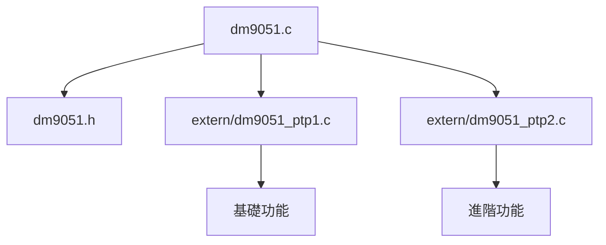

# DM9051A Driver User's Guide

---

**Begin Page**

Welcome to the DM9051A Linux Driver User's Guide. This document provides an overview, structure analysis, and practical programming instructions for using the Davicom DM9051A SPI Fast Ethernet Linux driver. Whether you are a developer integrating the DM9051A into your system or a user seeking to configure and debug the driver, this guide will help you understand and utilize the driver's features effectively.

---

# DM9051 Linux Driver Structure Analysis

## 1. **Overview**
- The driver provides support for the Davicom DM9051 SPI Fast Ethernet chip.
- It is implemented as a Linux kernel network driver, supporting standard netdev and ethtool interfaces.
- The driver supports both hardware and software PTP (Precision Time Protocol) timestamping, as well as various configuration and diagnostic features.

## 1.1 **Project and File Structure**

本專案目錄結構如下：

```
1_v3.9.5b/
├── dm9051.c                    # 主驅動程式檔案
├── dm9051.h                    # 主標頭檔案
├── extern/                     # 外部模組目錄
│   ├── dm9051_ptp1.h          # PTP 標頭檔案
│   ├── dm9051_ptp1.c          # PTP 基礎功能實作
│   └── dm9051_ptp2.c          # PTP 進階功能實作
└── Makefile                   # 編譯配置檔案
```

- `dm9051.c`：主驅動程式檔案，實作核心邏輯。
- `dm9051.h`：主標頭檔案，定義主要結構與函式。
- `extern/`：外部模組，包含 PTP、日誌等功能。
  - `dm9051_ptp1.h`：PTP 主標頭檔案
  - `dm9051_ptp1.c`：PTP 基礎功能。
  - `dm9051_ptp2.c`：PTP 進階功能。
- `Makefile`：編譯配置檔案。

### 模組依賴關係



## 2. **Key Data Structures**
### a. `struct board_info`
- Central structure holding all state and configuration for a DM9051 device instance.
- Contains pointers to SPI device, net_device, PHY, regmap, work queues, statistics, and PTP info.

### b. `struct ptp_board_info`
- Holds PTP (Precision Time Protocol) related state and configuration.

### c. `struct dm9051_rxhdr`
- 用於 RX 封包標頭處理。

### d. `struct dm9051_rxctrl`
- 用於 RX 封包控制與過濾。

### e. `struct rx_ctl_mach`
- 用於 RX 封包統計與狀態管理。

## 3. **Driver Initialization Flow**
- **Probe**: `dm9051_probe()` is called when the SPI device is detected.
  - Allocates and initializes `net_device` and `board_info`.
  - Sets up regmap for register access.
  - Reads and sets MAC address.
  - Registers MDIO bus and connects PHY.
  - Registers the network device with the kernel.
  - Initializes work queues and mutexes.
  - Sets up PTP and checksum features.

## 4. **Network Device Operations**
- **Open**: `dm9051_open()` brings up the device, powers up PHY, resets chip, enables interrupts, and starts PHY.
- **Stop**: `dm9051_stop()` disables interrupts, powers down PHY, and stops the network queue.
- **Transmit**: `dm9051_start_xmit()` queues packets for transmission and schedules work.
- **Receive**: Handled in interrupt context and work queues, using `dm9051_loop_rx()`.

## 5. **Register and Memory Access**
- Uses Linux regmap API for register and memory access over SPI.
- Provides functions for reading/writing registers, bulk memory, and EEPROM.

## 6. **Interrupt and Polling**
- Supports both interrupt-driven and polling modes (configurable via macros).
- Uses threaded IRQ handlers and work queues for deferred processing.

## 7. **PTP (Precision Time Protocol)**
- Supports hardware and software timestamping for PTP.
- Implements ethtool and netdev ops for timestamping configuration.

### PTP Macro Remapping Explained

In the DM9051 driver, PTP (Precision Time Protocol) support is modular and configurable at compile time. The following code block from `dm9051.h` demonstrates how macros are used to remap generic PTP operation names to specific function implementations when hardware PTP support is enabled (i.e., when `DMPLUG_PTP` is defined):

```c
#if defined(DMPLUG_PTP)
#undef PTP_VER
#undef PTP_SETUP
#undef PTP_CHECKSUM_LIMIT
//#undef PTP_NEW
#undef PTP_INIT_RCR
#undef PTP_INIT
#undef PTP_END
#undef PTP_STATUS_BITS
#undef PTP_AT_RATE

#define PTP_VER(b)                ptp_ver(b)
#define PTP_SETUP(b)              dm9051_operation_set_extend(b,1)
#define PTP_CHECKSUM_LIMIT(b,nd)  dm9051_checksum_limit(b,nd)
//#define PTP_NEW(d)              ptp_new(d)
#define PTP_INIT_RCR(d)           ptp_init_rcr(d)
#define PTP_INIT(d)               ptp_init(d)
#define PTP_END(d)                ptp_end(d)
#define PTP_STATUS_BITS(b)        ptp_status_bits(db)
#define PTP_AT_RATE(b)            on_core_init_ptp_rate(b)

#undef DMPLUG_RX_TS_MEM
#undef DMPLUG_RX_HW_TS_SKB
#undef SHOW_ptp_rx_packet_monitor
#undef DMPLUG_NOT_CLIENT_DISPLAY_RXC_FROM_MASTER

#define DMPLUG_RX_TS_MEM(b)               dm9051_read_ptp_tstamp_mem(b)
#define DMPLUG_RX_HW_TS_SKB(b,s)          dm9051_ptp_rx_hwtstamp(b,s)
#define SHOW_ptp_rx_packet_monitor(b,s)   dm9051_ptp_rx_packet_monitor(b,s)
#define DMPLUG_NOT_CLIENT_DISPLAY_RXC_FROM_MASTER(b) \
        dm9051_ptp_rxc_from_master(b)

#undef DMPLUG_PTP_TX_IN_PROGRESS
#undef DMPLUG_PTP_TX_PRE
#undef DMPLUG_TX_EMIT_TS
#undef dm9051_single_tx

#define DMPLUG_PTP_TX_IN_PROGRESS(b,s)    dm9051_ptp_tx_in_progress(b,s)
#define DMPLUG_PTP_TX_PRE(b,s)            dm9051_ptp_txreq(b,s)
#define DMPLUG_TX_EMIT_TS(b,s)            dm9051_ptp_txreq_hwtstamp(b,s)
#define dm9051_single_tx(b,s)             dm9051_ptp_packet_send(b,s)
#endif
```

**Explanation:**
- This block first undefines any previous macro definitions for PTP-related operations, then redefines them to point to the actual hardware PTP-supporting functions.
- This allows the main driver code to use generic macro names (like `PTP_INIT(db)` or `DMPLUG_RX_TS_MEM(db)`), which are mapped to the correct implementation depending on the build configuration.
- If `DMPLUG_PTP` is not defined, these macros may be mapped to stubs, software-only, or no-op implementations, allowing the same driver code to support different hardware and feature sets.
- This design keeps the codebase clean, modular, and easy to maintain, while providing flexibility for enabling or disabling PTP features at compile time.

**Summary Table:**

| Macro Name                        | Mapped Function                   | Purpose/Description                                                                 |
|------------------------------------|-----------------------------------|-------------------------------------------------------------------------------------|
| `PTP_VER(b)`                      | `ptp_ver(b)`                      | Version or capability check/init for PTP.                                           |
| `PTP_SETUP(b)`                    | `dm9051_operation_set_extend(b,1)`| Enable/initialize PTP operation in the board info structure.                        |
| `PTP_CHECKSUM_LIMIT(b,nd)`        | `dm9051_checksum_limit(b,nd)`     | Adjust checksum offload settings for PTP operation.                                 |
| `PTP_INIT_RCR(d)`                 | `ptp_init_rcr(d)`                 | Initialize Receive Control Register for PTP.                                        |
| `PTP_INIT(d)`                     | `ptp_init(d)`                     | General PTP initialization.                                                         |
| `PTP_END(d)`                      | `ptp_end(d)`                      | Cleanup or shutdown PTP operation.                                                  |
| `PTP_STATUS_BITS(b)`              | `ptp_status_bits(db)`             | Get status bits relevant to PTP operation.                                          |
| `PTP_AT_RATE(b)`                  | `on_core_init_ptp_rate(b)`        | Set or check PTP rate/timing parameters.                                            |
| `DMPLUG_RX_TS_MEM(b)`             | `dm9051_read_ptp_tstamp_mem(b)`   | Read PTP timestamp memory (for RX).                                                 |
| `DMPLUG_RX_HW_TS_SKB(b,s)`        | `dm9051_ptp_rx_hwtstamp(b,s)`     | Attach hardware RX timestamp to socket buffer.                                      |
| `SHOW_ptp_rx_packet_monitor(b,s)` | `dm9051_ptp_rx_packet_monitor(b,s)`| Monitor/display RX PTP packets for debugging.                                       |
| `DMPLUG_NOT_CLIENT_DISPLAY_RXC_FROM_MASTER(b)` | `dm9051_ptp_rxc_from_master(b)` | Display RXC (receive clock) info from PTP master.                                   |
| `DMPLUG_PTP_TX_IN_PROGRESS(b,s)`  | `dm9051_ptp_tx_in_progress(b,s)`  | Indicate/check if a PTP TX is in progress.                                          |
| `DMPLUG_PTP_TX_PRE(b,s)`          | `dm9051_ptp_txreq(b,s)`           | Prepare for a PTP TX request.                                                       |
| `DMPLUG_TX_EMIT_TS(b,s)`          | `dm9051_ptp_txreq_hwtstamp(b,s)`  | Emit a hardware TX timestamp.                                                       |
| `dm9051_single_tx(b,s)`           | `dm9051_ptp_packet_send(b,s)`     | Send a single PTP packet (with timestamping).                                       |

## 8. **EtHTool Support**
- Implements standard ethtool operations for driver info, statistics, EEPROM, pause parameters, and timestamping.

---

# User Programming Guide for DM9051 Linux Driver

## 1. **Building and Loading the Driver**
- Ensure your kernel has SPI and network support enabled.
- Build the driver as a module or built-in.
- Load the driver using `modprobe dm9051` or ensure it is loaded at boot via device tree.

## 2. **Device Tree Binding**
- Example device tree node:
  ```dts
  &spi1 {
      status = "okay";
      dm9051@0 {
          compatible = "davicom,dm9051";
          reg = <0>;
          spi-max-frequency = <10000000>;
          interrupt-parent = <&gpio1>;
          interrupts = <10 IRQ_TYPE_LEVEL_LOW>;
      };
  };
  ```

## 3. **Network Interface Usage**
- The driver registers a standard network interface (e.g., `eth0`).
- Bring up the interface:
  ```sh
  ip link set eth0 up
  ```
- Assign an IP address:
  ```sh
  ip addr add 192.168.1.100/24 dev eth0
  ```
- Use standard tools (`ifconfig`, `ethtool`, `ip`, etc.) to manage the interface.

## 4. **EtHTool Operations**
- Get driver info:
  ```sh
  ethtool -i eth0
  ```
- Get/set pause parameters:
  ```sh
  ethtool -a eth0
  ethtool -A eth0 rx on tx on
  ```
- Get statistics:
  ```sh
  ethtool -S eth0
  ```
- Get/set EEPROM:
  ```sh
  ethtool -e eth0
  ethtool -E eth0 magic 0x9051 offset 0 value 0x12
  ```

## 5. **PTP/Time Stamping**
- The driver supports PTP via ethtool and socket options.
- Query timestamping capabilities:
  ```sh
  ethtool -T eth0
  ```
- Use `linuxptp` or similar tools for PTP synchronization.

## 6. **Custom Features and Debugging**
- The driver provides extensive debug output via `netif_*` macros.
- Enable debug messages by adjusting `msg_enable` via ethtool:
  ```sh
  ethtool -s eth0 msglvl 0xFFFFFFFF
  ```
- Check kernel logs (`dmesg`) for driver messages.

## 7. **Advanced Configuration**
- The driver supports various compile-time options via macros in `dm9051.h` (e.g., interrupt mode, PTP, watchdog).
- Modify these macros and rebuild the driver for custom behavior.

## 8. **Extending the Driver**
- To add features (e.g.,

---

**End Page**

Thank you for using the DM9051A Linux Driver User's Guide. For further information, updates, or support, please refer to the official Davicom documentation or contact your platform provider. Happy networking!