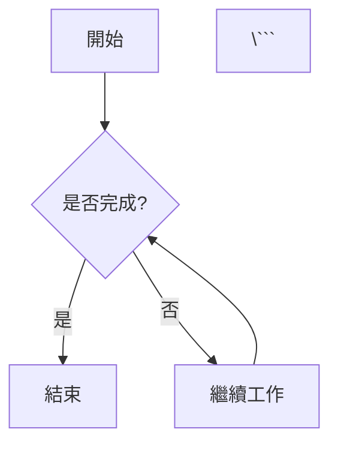

# Markdown 文件格式規範

## 使用場景
- 創建、編輯、生成 Markdown（.md 後綴）文件格式

## 關鍵規則

### 基本語法
- 使用標準 Markdown 語法格式
- 不要使用 Markdown 標準以外的語法格式
- 標題層級合理使用，從 `#` 開始，按層級遞增（`##`, `###`等）
- 段落之間要空行分隔
- 列表使用 `-`、`*` 或數字標號，保持一致性
- 代碼塊使用三個反引號包圍，並標明語言
- 引用使用 `>` 符號
- 鏈接使用 `[顯示文字](URL)` 格式
- 圖片使用 `` 格式

## 關鍵規則

### 語法規範
- 使用標準 Markdown 語法格式
- 不要使用 Markdown 標準以外的語法格式
- 標題層級合理使用，從 # 開始，按層級遞增（##, ###等）
- 段落之間要空行分隔
- 列表使用 `-`、`*` 或數字標記，保持一致性
- 代碼塊使用三個反引號包圍，並標明語言
- 引用使用 `>` 符號
- 鏈接使用 `[顯示文字](URL)` 格式
- 圖片使用 `` 格式
- 表格使用 `|` 符號分列，使用 `-` 符號分隔表頭
- 編輯文本使用 `*斜體*` 或 `**粗體**`
- 如果圖使用 `mermaid` 格式
- ...

---

## 範例展示

### 標題範例
```markdown
# 一級標題
## 二級標題
### 三級標題
#### 四級標題
##### 五級標題
###### 六級標題
```

### 文字格式範例
```markdown
這是普通文字

**這是粗體文字**

*這是斜體文字*

***這是粗斜體文字***

~~這是刪除線文字~~

`這是行內代碼`
```

### 列表範例
```markdown
#### 無序列表
- 項目 1
- 項目 2
  - 子項目 2.1
  - 子項目 2.2
- 項目 3

#### 有序列表
1. 第一項
2. 第二項
   1. 子項目 2.1
   2. 子項目 2.2
3. 第三項
```

### 鏈接和圖片範例
```markdown
#### 鏈接
[GitHub](https://github.com)

[相對路徑鏈接](./other_file.md)

#### 圖片


```

### 代碼塊範例
```markdown
#### 行內代碼
使用 `printf()` 函數輸出文字。

#### 代碼塊
```c
#include <stdio.h>

int main() {
    printf("Hello, World!\n");
    return 0;
}
\```
```

### 引用範例
```markdown
> 這是一個引用文字
>
> 這是引用的第二段
>> 這是嵌套引用
```

### 表格範例
```markdown
| 項目 | 描述 | 狀態 |
|------|------|------|
| 功能A | 基本功能 | ✅ 完成 |
| 功能B | 進階功能 | 🔄 進行中 |
| 功能C | 未來功能 | ❌ 未開始 |
```

### 分割線範例
```markdown
---

***

___
```

### 任務列表範例
```markdown
- [x] 已完成任務
- [ ] 未完成任務
- [ ] 另一個未完成任務
```

### 數學公式範例（如果支援）
```markdown
行內公式：$E = mc^2$

塊級公式：
$$
\sum_{i=1}^{n} x_i = x_1 + x_2 + \cdots + x_n
$$
```

### Mermaid 圖表範例
```markdown


---

## 檔案命名規範

### 基本規則
- 使用 `snake_case` 命名法（小寫字母，單詞間用底線分隔）
- 檔案名應具有描述性
- 使用 `.md` 副檔名

### 範例
```
user_manual.md
api_documentation.md
getting_started.md
troubleshooting_guide.md
```

---

## 文檔結構建議

### 標準文檔結構
```markdown
# 文檔標題

## 概述
簡要說明文檔目的和內容

## 目錄
- [第一章](#第一章)
- [第二章](#第二章)
- [附錄](#附錄)

## 第一章
詳細內容...

## 第二章
詳細內容...

## 附錄
額外資訊...

---

## 版本資訊
- 版本：1.0.0
- 更新日期：2024-01-01
- 作者：開發團隊
```

---

## 最佳實踐

### 內容組織
1. **保持一致性**：在整個文檔中使用統一的格式和風格
2. **層次清晰**：合理使用標題層級，避免跳級
3. **簡潔明瞭**：使用清晰、簡潔的語言
4. **適當分段**：避免過長的段落，提高可讀性

### 技術文檔特殊要求
1. **代碼示例**：為所有代碼塊指定正確的語言標籤
2. **API 文檔**：使用表格清晰展示參數和返回值
3. **錯誤處理**：明確標示可能的錯誤情況和解決方案
4. **版本控制**：記錄文檔的版本變更歷史

### 協作規範
1. **提交規範**：commit 訊息應清楚描述變更內容
2. **審查流程**：重要文檔變更應經過 peer review
3. **更新頻率**：定期檢查和更新文檔內容
4. **備份策略**：重要文檔應有備份機制

---

## 工具推薦

### 編輯器
- Visual Studio Code（推薦插件：Markdown All in One）
- Typora
- Mark Text
- 線上編輯器：StackEdit, Dillinger

### 預覽工具
- GitHub/GitLab 內建預覽
- Markdown 預覽插件
- 靜態網站生成器：GitBook, MkDocs

---

*此規範遵循標準 Markdown 語法，適用於技術文檔、專案說明、使用手冊等各類文件的編寫。*